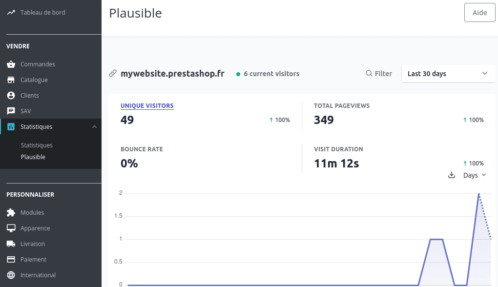
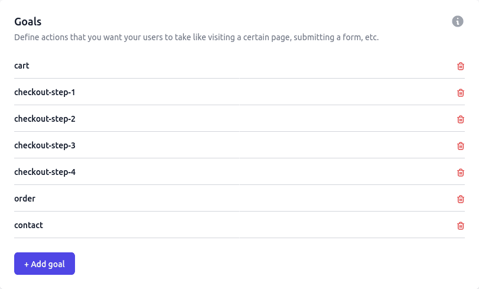

# Prestashop Plausible

[](https://php.net/)
[](https://www.prestashop.com)
[](https://github.com/Pixel-Open/prestashop-plausible/releases)

## Presentation

Add Plausible Analytics in Prestashop.



## Requirements

- Prestashop >= 1.7.6.0
- PHP >= 7.2.0

## Installation

Download the **pixel_plausible.zip** file from the [last release](https://github.com/Pixel-Open/prestashop-plausible/releases/latest) assets.

### Admin

Go to the admin module catalog section and click **Upload a module**. Select the downloaded zip file.

### Manually

Move the downloaded file in the Prestashop **modules** directory and unzip the archive. Go to the admin module catalog section and search for "Plausible".

## Configuration

From the module manager, find the module and click on configure.

| Field                  | Description                                                                   | Example                                                  | Required |
|:-----------------------|:------------------------------------------------------------------------------|----------------------------------------------------------|----------|
| Add JavaScript snippet | Enable stats by including the Plausible snippet in the <head> of your website | Yes                                                      | Y        |
| Default goals          | Enable default goal events: contact, cart, checkout-step-X, order             | Yes                                                      | Y        |
| Shared Link            | The shared link allows to display stats in the "Statistics > Plausible" menu  | https://plausible.io/share/website.prestashop?auth=xxxxx | N        |

Create the **shared link** in your Plausible settings for the site in *Visibility > Shared links > + New link*

## Stats

In the Prestashop admin, the Plausible stats are available in the *Statistics > Plausible* menu.

## Goals

The module includes default goal events when enabled in module configuration.

- Contact message sent (contact)
- Cart view (cart)
- Checkout step X (checkout-step-X)
- Order complete (order)

You need to add goal events in your Plausible website configuration:



These goals work with the classic Prestashop theme, you can adapt or add custom goals if needed.

### How to remove a default goal?

Override the `pixel_plausible/views/templates/goals.tpl` file and remove the event call you don't need.

You can also disable default goals in the module configuration and implement your own event logic.

### How to add a custom goal?

In any template or JS file, use the `plausible` method to send the event to Plausible. Example:

```html
<input type="button" value="My Button" id="my-form-button" />

<script type="text/javascript">
    const myButton = document.getElementById('my-form-button');
    if (myButton) {
        myButton.addEventListener('click', function() {
            plausible('my-form-button'); // "my-form-button" is the Plausible goal event name
        });
    }
</script>
```